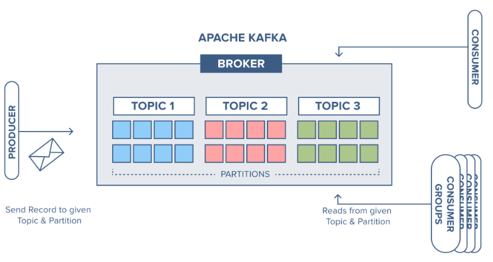

### 1. ActiveMQ, Kafka ve RabbitMQ karşılaştırın. Örnek kodlar ile nasıl çalıştığını anlatın.

- ActiveMQ , Kafka ve RabbitMQ , asenkron iletişim sağlamak için kullanılan mesajlaşma teknolojileridir. Bunlara mesaj
  kuyrukları da denir. Hepsi temel olarak aynı amaca farklı şekillerde hizmet ederler.

``ActiveMQ :`` JMS API'ını uygulayan açık kaynaklı bir mesaj aracısıdır.

- ``MessageSender`` sınıfı JMS API ında bulunan ``MessageProducer`` sınıfına ait ``send()`` metodunu kullanarak kuyruğa bir mesaj gönderir.

````
public class MessageSender {
    
    //URL of the JMS server.
    private static String url = ActiveMQConnection.DEFAULT_BROKER_URL;
    
    private static String subject = "JCG_QUEUE"; // Queue Name.
    //You can create any/many queue names as per your requirement. 
    
    public static void main(String[] args) throws JMSException {        
        // Getting JMS connection from the server and starting it
        ConnectionFactory connectionFactory = new ActiveMQConnectionFactory(url);
        Connection connection = connectionFactory.createConnection();
        connection.start();
        
        //Creating a non transactional session to send/receive JMS message.
        Session session = connection.createSession(false,
                Session.AUTO_ACKNOWLEDGE);  
        
        //Destination represents here our queue 'JCG_QUEUE' on the JMS server. 
        //The queue will be created automatically on the server.
        Destination destination = session.createQueue(subject); 
        
        // MessageProducer is used for sending messages to the queue.
        MessageProducer producer = session.createProducer(destination);
        
        // We will send a small text message saying 'Hello World!!!' 
        TextMessage message = session
                .createTextMessage("Hello !!! Welcome to the world of ActiveMQ.");
        
        // Here we are sending our message!
        producer.send(message);
        
        System.out.println("JCG printing@@ '" + message.getText() + "'");
        connection.close();
    }
}
````

- ``MessageReceiver`` sınıfı JMS API ında bulunan ``MessageConsumer`` sınıfına ait ``receive()`` metodunu kullanarak kuyruğa bir mesaj gönderir.

````
public class MessageReceiver {

    // URL of the JMS server
    private static String url = ActiveMQConnection.DEFAULT_BROKER_URL;

    // Name of the queue we will receive messages from
    private static String subject = "JCG_QUEUE";

    public static void main(String[] args) throws JMSException {
        // Getting JMS connection from the server
        ConnectionFactory connectionFactory = new ActiveMQConnectionFactory(url);
        Connection connection = connectionFactory.createConnection();
        connection.start();

        // Creating session for seding messages
        Session session = connection.createSession(false,
                Session.AUTO_ACKNOWLEDGE);

        // Getting the queue 'JCG_QUEUE'
        Destination destination = session.createQueue(subject);

        // MessageConsumer is used for receiving (consuming) messages
        MessageConsumer consumer = session.createConsumer(destination);

        // Here we receive the message.
        Message message = consumer.receive();

        // We will be using TestMessage in our example. MessageProducer sent us a TextMessage
        // so we must cast to it to get access to its .getText() method.
        if (message instanceof TextMessage) {
            TextMessage textMessage = (TextMessage) message;
            System.out.println("Received message '" + textMessage.getText() + "'");
        }
        connection.close();
    }
}
````

- ``Connection`` JMS ile ActiveMQ bağlantısını sağlar.
- ``Destination`` Kullanılacak kuyruk belirlenir. Burada sender sınıfında belirtmiş olduğumuz JCG_QUEUE kullanılır mesaj gönderildiğinde otomatik olarak bu isimde bir kuyruk oluşur.

- Proje çalıştırıldığında mesajı kimin okuyacağını bilmeden kuyruğa göndeririz. Daha sonra bu kuyruğa bağlantı kurmuş dinleyen sınıflar kuyruktan mesajı alır ve işler.

``Kafka`` Birlikte çalışan sistemlerin birbirlerine olan bağımlıklıklarını ortadan kaldırarak, üzerlerindeki yüklerini de düşürecek bir yapı inşa edilmesini sağlar.



- ``Topic`` Mesajların tutulduğu bir koleksiyondur.
- ``Partition`` Topiclerin bir araya gelmesi ile partitionlar oluşur.
- ``Broker`` Partitionlar bir araya gelerek broker ı oluşturur.
- ``Consumer`` mesajları okuyanlara denir; birçok consumer bir araya gelerek belirli bir düzen içinde okuma yapınca bu duruma ``consumer group`` denir.

``String Producer Example :`` Kafka Brokerına producer ın send metodu ile mesaj gönderen example.
````
public class StringProducerExample {

    public static void main(String args[]) {

        //properties for producer
        Properties props = new Properties();
        props.put("bootstrap.servers", "localhost:9092");
        props.put("key.serializer", "org.apache.kafka.common.serialization.IntegerSerializer");
        props.put("value.serializer", "org.apache.kafka.common.serialization.StringSerializer");

        //create producer
        Producer<Integer, String> producer = new KafkaProducer<Integer, String>(props);

        //send messages to my-topic
        for(int i = 0; i < 100; i++) {
            ProducerRecord producerRecord = new ProducerRecord<Integer, String>("my-topic", i, "Test Message #" + Integer.toString(i));
            producer.send(producerRecord);
        }

        //close producer
        producer.close();
    }

}

````
- Mesajın Kafka iletilebilmesi için ZooKeeper sunucusuna ve çalışan bir kafka sunucusuna ihtiyacımız var. Sunucuları ayağa kaldırdıktan sonra bir topic oluşturmamız gerekiyor.
````
# creating my-topic topic $KAFKA_HOME/bin/kafka-topics.sh --create --zookeeper localhost:2181 --replication-factor 1 --partitions 1 --topic my-topic 
 ````
- Daha sonra mesajları komut satırından veya ıde den gönderebiliriz.
````
java -cp bigdatums-kafka-1.0-SNAPSHOT.jar net.bigdatums.kafka.producer.StringProducerExample
````

- Gönderilen kodları ise aşağıdaki komutla okuyabiliriz.
````
# consuming messages from Kafka
 
$KAFKA_HOME/bin/kafka-console-consumer.sh --bootstrap-server localhost:9092 --topic my-topic --from-beginning

output:

Test Message #0
Test Message #1
Test Message #2
Test Message #3
Test Message #4
Test Message #5
Test Message #6
````

``RabbitMQ`` 

````
public class RabbitMQService {

	@Autowired
	private RabbitTemplate rabbitTemplate;

	public void sendEmail(String email) {
		rabbitTemplate.convertAndSend("isbasi.email", "", email);
	}
````
- rabbit template i kullanılarak mesaj belirtilen kuyruğa gönderilir.
````
public class EmailListener {
	
	@RabbitListener(queues = "isbasi.email")
	public void emailListener(String email) {
		log.info("email address: {}", email);	
		// TO DO mail at
	}

}
````
- email listener metoduna dinlemesi gereken kuyruk adı belirtilir kuyrukta gelen veri parametre olarak alınır ve işlenir.

- Genel itibari ile ActiveMQ hızlı ve performanslıdır fakat veri büyüdükçe performans ve ölçeklendirme problemleri yaşanabilir. Kafka, performans ölçeklendirme ve yönetilebilirlik açısından önplana çıkmaktadır. RabbitMQ ise genel itibari ile çoklu işletim sistemi desteğinden dolayı tercih edilmektedir.

### 2. Microservis ve monolith mimariyi karşılaştırın.

``Mikro servis mimarisi`` 
- Her bir servisin bağımsız olarak dağıtılabilir, güncellenebilir olmasından,
- Daha küçük yapılara bölündüğü için yönetilebilir olmasından,
- Daha iyi ölçeklendirilebilir olmasından,
- Her bir servis için ihtiyacın olan teknolojiyi kullanılabilme yeteneği sayesinde teknoloji çeşitliği olmasından,
- Yeniden kullanılabilirliği yüksek olmasından dolayı daha avantajlıdır.

``Monolith``
- Microservice mimarisinin aksine, monolitik uygulamaların hata ayıklaması ve test edilmesi çok daha kolay olmasından,
- Kolay deployment yapılabilmesinden,
- Uygulamayı genel prensiplere uyarak modüler bir biçimde yazılabilmesinden dolayı daha avantajlıdır. Fakat günümüzde monolith mimari daha çok küçük ekiplerin tercihi olmaktadır ve daha geleneksel bir yapı olarak nitelendirilmektedir.

### 3. SOAP - RESTful karşılaştırın

- ``Güvenlik``: SOAP üzerinde güvenlik(security) sağlamak daha kolay ve hızlı şekilde yapılabiliir, fakat bu durum REST için daha karmaşıktır.

- ``Data Yapısı``: REST ile JSON, XML hatta TEXT ile çalışabiliyorken, SOAP ile XML kullanılır. REST bu açıdan daha kullanışlıdır.

- ``Uygulama Hızı``: Uygulama hızı açısından REST daha ön plandadır.

- ``Destek``: SOAP için geliştirici araçları daha iyidir. Kullanmamız için bize yardımcı olacak daha çok kaynak bulabiliriz. REST’in dökümantasyonu SOAP’a göre daha azdır.

- REST yaklaşımı HTTP metotlarını kullanarak işlerini görür. GET,POST,PUT,DELETE vs.

- SOAP servisleri RPC(Remote Process Call yani uzaktaki bir prosedürün çağrılması) çalışma yöntemini kullanır, 

- REST mimarisi SOAP’a göre oldukça esnektir ve hafiftir, taşınan veri miktarı daha azdır, entegrasyonu da daha kolaydır.


